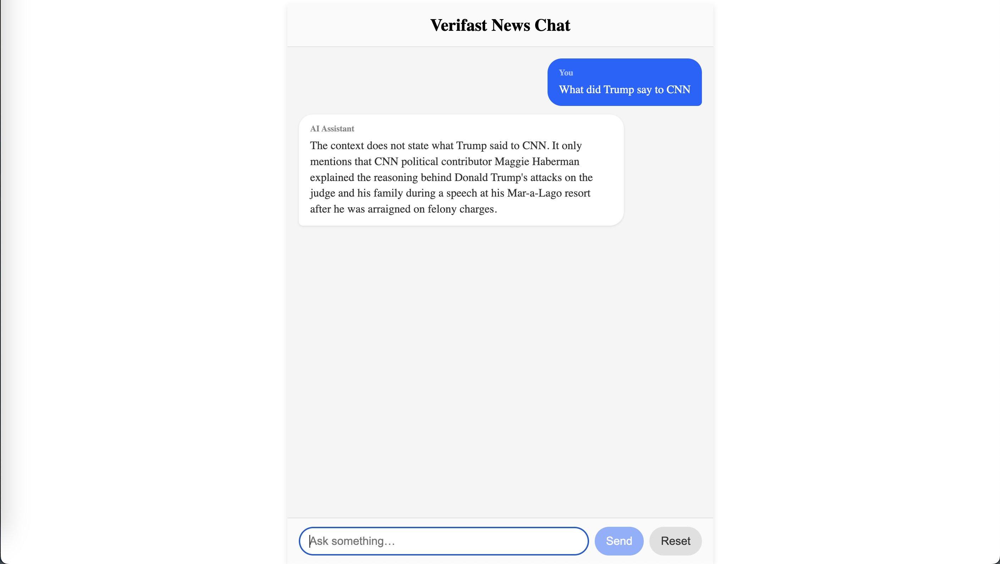

# Verifast RAG Chat – Full Stack AI Chatbot

This is a full-stack AI-powered chatbot that answers user queries over the latest news articles using a **Retrieval-Augmented Generation (RAG)** pipeline.

this project demonstrates:
- End-to-end ingestion of real-world data (RSS feeds)
- Vector-based search using Chroma DB
- Embedding with Jina AI
- Semantic response generation using **Gemini**
- Stateful chat interface with frontend/backend integration

---

## Tech Stack

| Layer        | Technology                        |
|--------------|-----------------------------------|
| Frontend     | React.js, plain CSS               |
| Backend      | FastAPI, Redis, Gemini API        |
| Embeddings   | LangChain + JinaEmbeddings        |
| Vector Store | Chroma DB (local persistent)      |
| State Cache  | Redis                             |

---

## Quickstart

### 1. Setup Python backend
```bash
cd backend/
python -m venv venv
source venv/bin/activate
pip install -r requirements.txt
uvicorn backend.main:app --reload --port 8000
```

### 2. Setup frontend
```bash
cd frontend/
npm install
npm start
```

### 3. ai_app News Articles
```bash
cd ai_app
python ai_app.py
```

## Detailed

| Part      | Description                                  | Link                                         |
| --------- | -------------------------------------------- | -------------------------------------------- |
| ai_app | Fetch, embed, and index news data            | [`ai_app/README.md`](./ai_app/README.md)     |
| Backend   | API endpoints, WebSocket, Gemini integration | [`backend/README.md`](./backend/README.md)   |
| Frontend  | UI chat interface + session management       | [`frontend/README.md`](./frontend/README.md) |

## Features

- News-based chatbot with semantic understanding

- Stateless frontend + stateful backend (session-based)

- Embedding pipeline with fallback error handling

- Redis caching for chat history

- Clean architecture for extensibility

## Flow

- Start the backend server at 8000 port 

- Start the frontend (React dev server) at 3000 port

- Ingest RSS news articles to build the vector DB

- Open the app → Ask any news-related question

- Responses are retrieved, contextualized, and streamed using Gemini

## Notes

- Designed to run locally

## questions that can be asked

```
    "What did CNN report about Trump this week?",
    "Tell me the latest news about the Israel-Gaza conflict.",
    "What’s happening in US politics today?",
    "Any news related to climate change?",
    "Summarize CNN’s top headline for today."
    "What did CNN say about Elon Musk?",
    "Is there anything about AI in the recent news?",
    "What are the economic updates reported?",
    "Has CNN published anything on Ukraine recently?",
    "Show me what CNN covered about the Supreme Court."
    "Summarize the CNN article about Trump’s court appearance.",
    "What did the news say about Marjorie Taylor Greene?",
    "Explain CNN’s report on the Fed’s interest rate decision.",
    "What’s CNN’s take on the current tech layoffs?"
    "Can you explain what happened based on the latest CNN news?",
    "Who was mentioned in CNN’s top stories?",
    "What legal cases did CNN cover this week?"

```

## Frontend



## backend


## questons:

#### 1. How embeddings are created, indexed, and stored
- created an ingestion script (ai_app.py) that:
- Fetched ~50 news articles from an RSS feed.
- Clean and combined content (title + summary + description + content) per article.
- Used LangChain’s JinaEmbeddings with your JINAAI API key to generate vector embeddings.
- Stored the documents + embeddings into Chroma, a local vector database
- Each document is converted into a numerical vector and stored in a persistent Chroma DB (chroma_db/) under the collection name (e.g. "news").

#### 2. How Redis caching & session history works
- created cache.py to manage session-based message history using Redis.
- pushed to Redis
    ```python
    await push(session_id, "user", user_message)
    await push(session_id, "assistant", answer)
    ```
- Redis keys like session:abc123 to group messages per session.
- The chat history is retrieved with:
    ```python
    await history(session_id)
    ```
- The session is cleared via:
    ```python
    await clear(session_id)
    ```

#### 3. How the frontend calls API/Socket and handles responses
- send messages to FastAPI backend using a POST API:
    ```js
    await fetch("http://localhost:8000/chat/send", { ... })
    ```

- Gemini responses are streamed chunk-by-chunk using a TextDecoderStream:
    ```js
    const reader = res.body.pipeThrough(new TextDecoderStream()).getReader();
    ```

- dynamically showed the growing assistant response in the UI as it streams in.

#### 4. Design Highlights:
- RAG pipeline: Embedded context from real news sources + LLM generation = better factual responses.
- Session-based history with Redis = scalable architecture.
- Gemini + LangChain combo shows modern stack.
- Separate ingestion step keeps AI data clean and decoupled from the UI/API.
- Clean React-based UI with streaming answers.

#### 5. Drawbacks
- Dockerization: Containerize backend + Chroma + Redis for easier deploy.
- Multi-source ingestion: Allow ingesting from multiple feeds (e.g., Reuters, BBC, etc).

